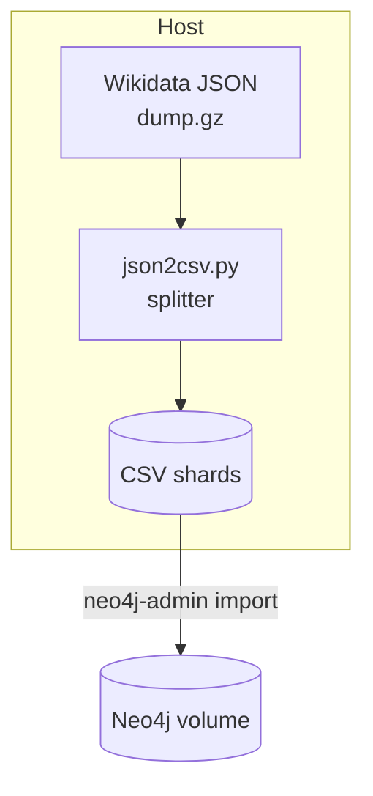

# index-core

Bootstrap scripts & docs for loading the **Wikidata JSON dump** into a Neo4j database, creating the public “data core” that every `index` tenant can query or fall back to.

> **Main app repo:** [`index`](https://github.com/adambuilds/index)  
> **This repo:** `index-core`

---

## ✨ Why this repo exists

* Provide a **turn‑key seed graph** so new tenants don’t start from an empty database.  
* Keep the import pipeline **repeatable & auditable** (dumps are ~100 GB compressed).  
* Isolate heavy ETL logic from the web/API codebase.

---

## Table of contents

1. [Quick start](#quick-start)  
2. [Architecture](#architecture)  
3. [Directory structure](#directory-structure)  
4. [Updating the core data](#updating-the-core-data)  
5. [Design decisions](#design-decisions)  
6. [Roadmap](#roadmap)  
7. [Contributing](#contributing)  
8. [License](#license)

---

## Quick start

> Prereqs: `docker` ≥ 24 • `docker compose` • ~250 GB free disk

```bash
git clone https://github.com/adambuilds/index-core.git
cd index-core

# 0. Copy the example env file and adjust as needed
cp .env.example .env

# 1. Spin up Neo4j (community edition by default)
docker compose up -d neo4j

# 2. Download the week’s Wikidata JSON dump (~85 GB)
make fetch-dump          # or ./scripts/fetch_dump.sh

# 3. Transform & import
make import              # runs ./scripts/json2csv.py + neo4j-admin import

# 4. Verification
make verify              # Cypher sanity checks (node/edge counts, indexes)

# 5. Open the browser
open http://localhost:7474
# user/pass = neo4j / neo4j (prompted to change on first login)
```

> **Tip:** On first run you can set `IMPORT_SAMPLE=1` in `.env` to import a 100 k‑item slice for faster iteration.

---

## Architecture



* **raw/** – untouched dump file (`wikidata-YYYYMMDD-all.json.gz`)  
* **work/** – streamed CSV shards (size-balanced for import)  
* **neo4j/** – mounted as Neo4j `/data` volume  

We import **items** and **statements** as a **property graph**:

| Neo4j label / rel | Wikidata concept |
|-------------------|------------------|
| `:Thing`          | Item (Q‑node)    |
| `:Property`       | Property (P‑node)|
| `(:Thing)-[:HAS {qualifiers…}]->(:Thing \| Literal)` | Statement |

See [`schemas/`](schemas/) for mapping details.

---

## Directory structure

```
index-core/
├── docker-compose.yml        # Neo4j + helper containers
├── .env.example              # tweak ports, heap, paths
├── scripts/
│   ├── fetch_dump.sh         # mirrors wikidata dumps server
│   ├── json2csv.py           # streaming transform (Python, ~3 GB RAM)
│   ├── import.sh             # wraps neo4j-admin import
│   └── verify.cypher         # post-import assertions
├── schemas/                  # node & relationship mappings
└── docs/
    ├── decision-records/     # Architecture Decision Records (ADRs)
    └── troubleshooting.md
```

---

## Updating the core data

| Task | Command | Notes |
|------|---------|-------|
| **Fetch latest weekly dump** | `make fetch-dump` | Idempotent; skips if file exists |
| **Rebuild graph from scratch** | `make rebuild` | Drops DB, re-imports |
| **Incremental update (daily)** | _TBD_ | Will use `apoc.periodic.iterate` |
| **Backup** | `make backup` | Dumps `.cypher` export to `backups/` |

---

## Design decisions

* **Neo4j 5 community** is the lowest common denominator; you can swap in Enterprise by changing the Docker image tag.  
* **CSV bulk import** is 10–20 × faster than streaming Cypher for first‑time load.  
* **Qualifiers & references** are stored as JSON on the `HAS` relationship for now; can be flattened later if query use‑cases demand it.  
* **Licensing** – Wikidata is **CC 0**; we retain that for the generated CSVs. Your proprietary data remains yours.

See ADRs in `docs/decision-records/` for more context.

---

## Roadmap

- [ ] Incremental‑update pipeline using Wikidata **JSON delta dumps**  
- [ ] Optional **APOC**‑powered property promotion (e.g. `label_en`, `description_en`)  
- [ ] **Docker image** publish to GHCR for one‑command cluster bootstrapping  
- [ ] Automated **Bloom** perspective export for quick graph exploration  
- [ ] **Unit tests** on mapping logic (pytest + CSV sampling)

---

## Contributing

Pull requests are welcome! Please:

1. Open an issue first if you’re planning a large change.  
2. Follow the existing shell / Python style (see `.editorconfig`).  
3. Sign off your commits (`git commit -s`) to indicate DCO compliance.

---

## License

Code in this repository is **MIT**.  
Generated data derived from Wikidata is **CC 0 1.0 Universal**.  
See [`LICENSE`](LICENSE) for full text.

---

_Questions? Open an issue or ping @adambuilds on GitHub._
